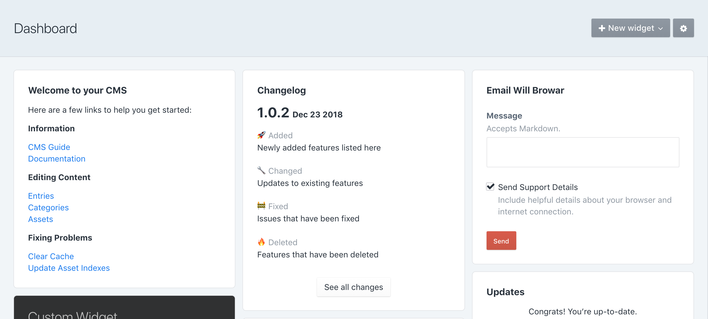

# Communicator plugin for Craft CMS 3.x

Tools that communicate project-specific information between clients and admins and developers.

> For users of [Guide](https://plugins.craftcms.com/guide) 1.3.x: This plugin is a replacement for the three widgets that are included in Guide. These three widgets and all of their data will be removed from Guide in a future update.

## Requirements

This plugin requires Craft CMS 3.1.1 or later.

## Installation

Communicator can be installed through the [Craft CMS Plugin Store](https://plugins.craftcms.com), or by following these instructions:

1. Open your terminal and go to your Craft project:

        cd /path/to/project

2. Then tell Composer to load the plugin:

        composer require wbrowar/communicator

3. In the Control Panel, go to Settings → Plugins and click the “Install” button for Communicator.

## Communicator Overview

Communicator has three major features:

### Changelog
A record of changes that have been made to the website or CMS that appears on a widget and in its own CP section.

Changelog includes:

- A CP section that shows all changelog entries.
- A widget that can be configured to show a desired amount of changelog entries.
  
### Global Widget
Widget content that is created once and distributed to all users who have the widget on their dashboard.

Global Widget includes:

- A widget that renders the content pulled from a single source.
- A CP section that allows permitted users to create and update content in either Markdown or Twig formats.

### Email Support
A widget that provides an email support form that can include details about the browser your client is using.

## Configuring Communicator

### Changelog Configuration
- To view the Changelog CP section, the `Access Communicator` is required.
- The `Edit Changelogs` permission is required to add and remove changelog entries.

### Global Widget Configuration
- To view the Global Widget CP section and edit Global Widget content, both the `Access Communicator` and `Edit Global Widget` permissions are required.

### Email Support Configuration
- Before a user may submit a support email, at least one support contact must be added.
  - Support contacts can be added on the Communicator plugin settings page.
- The email form may be disabled in Communicator plugin settings, and doing so will display the support contact‘s email and—if provided—phone number.

All features are enabled by default, however, if you don‘t need a specific feature, the Communicator plugin settings page will allow you to completely disable a feature. Disabling a feature will not remove its widgets from user dashboards. A message will state that the feature is disabled and that the widget can be removed.

## Using Communicator

### Using Changelog
- A user may add the Changelog widget to their dashboard and can configure the amount of changelog entries shown.
- They can also get to the Changelog CP section by clicking on the `Changelog` sidebar link or the button that appears at the bottom of the widget.
- Users with the ability to `Edit Changelogs` will see a form on the Changelog CP page that lets them add a new changelog entry.
  - Changelog entries use Markdown for rendering.
  - A template is provided to make editing easier, but it can also be ignored if this is not the desired format.
  - Using the specific headers, `Added, Changed, Fixed, Deleted`, as any level of header element, `H1, H2, H3, H4, H5, H6`, will result in specific styling and an appropriate emoji symbol.
    - For example, `# Added` will be converted to `🚀Added`
  - Changelog entries can be removed by clicking on the `Delete` button next to each entry.

### Using Global Widget
- A user may add the widget that displays the Global Widget header and content and there is nothing to configure.
  - If the Global Widget content is in Twig format, the information will be shown in context for the logged in user.
- Users with the `Edit Global Widget` permission, may visit the Global Widget CP section to edit the Global Widget content.

### Using Email Support
- Users who add the Email Support widget to their dashboard will be required to select a support contact before submitting a support email.

## Communicator Roadmap

Some things to do, and ideas for potential features:

* Provide a way to use a template path for Global Widget content so boilerplate content may be used from one project to another.
* Disable the ability for a user to select their contact person in the Email Support widget by providing default contact information for specific users.
* Add priorities to support emails and reflect that in the subject of the email.

Brought to you by [Will Browar](https://wbrowar.com)
